# 🚀 Comprehensive Guide: Unit Testing Best Practices for SFCC B2C Cartridges

<div align="center">


**🎯 Master unit testing for Salesforce Commerce Cloud B2C cartridges with modern tools and best practices**

</div>

---

## 📋 Table of Contents

1. [🎯 Introduction to Unit Testing for SFCC](#introduction)
2. [🛠️ Testing Framework Setup](#framework-setup)
3. [📝 Writing Your First Unit Test](#first-test)
4. [🎨 Coding Style Guidelines](#coding-styles)
5. [🔍 Chai Assertion Library](#chai-assertions)
6. [🎭 Mocking with SinonJS](#sinon-mocking)
7. [🏗️ Testing SFCC Cartridge Components](#testing-components)
8. [📊 Advanced Testing Patterns](#advanced-patterns)
9. [⚡ Performance & Best Practices](#best-practices)
10. [🔧 Tools & Configuration](#tools-configuration)
11. [📚 Real-World Examples](#examples)
12. [🎓 Conclusion](#conclusion)

---

## <a id="introduction"></a>🎯 Introduction to Unit Testing for SFCC

### What is Unit Testing?

Unit testing is the practice of **testing individual components or functions** of your SFCC cartridge code to ensure they work correctly in isolation[62][66]. It's like testing each gear in a watch before assembling the entire timepiece.

### 🎪 Why Unit Testing Matters for SFCC B2C Cartridges

```mermaid
graph TD
    A[🏗️ Better Code Quality] --> B[🐛 Early Bug Detection]
    B --> C[💰 Reduced Development Costs]
    C --> D[📈 Improved Maintainability]
    D --> E[🚀 Faster Deployment Cycles]
    E --> F[😊 Enhanced Customer Experience]
```



### ✨ Key Benefits

- 🎯 **Isolate Business Logic**: Test individual controller functions, models, and helpers
- 🔍 **Early Bug Detection**: Catch issues before they reach production
- 📚 **Documentation**: Tests serve as living documentation of your code
- 🚀 **Refactoring Confidence**: Make changes without fear of breaking existing functionality
- 💸 **Cost Reduction**: Fix bugs early when they're cheaper to resolve

---

## <a id="framework-setup"></a>🛠️ Testing Framework Setup

### 📦 Essential Testing Dependencies

```json
{
  "devDependencies": {
    "mocha": "^10.2.0",
    "chai": "^4.3.10",
    "sinon": "^16.1.0",
    "proxyquire": "^2.1.3",
    "nyc": "^15.1.0"
  },
  "scripts": {
    "test": "mocha test/**/*.js --recursive",
    "test:watch": "mocha test/**/*.js --recursive --watch",
    "test:coverage": "nyc mocha test/**/*.js --recursive"
  }
}
```

### 🏗️ Project Structure

```
app_custom_cartridge/
├── cartridge/
│   ├── controllers/
│   │   ├── Product.js
│   │   └── Cart.js
│   ├── models/
│   │   ├── product.js
│   │   └── cart.js
│   ├── scripts/
│   │   └── helpers/
│       └── productHelper.js
│   └── config/
└── test/
    ├── unit/
    │   ├── controllers/
    │   │   ├── Product.test.js
    │   │   └── Cart.test.js
    │   ├── models/
    │   │   ├── product.test.js
    │   │   └── cart.test.js
    │   └── scripts/
    │       └── helpers/
    │           └── productHelper.test.js
    ├── fixtures/
    │   ├── products.json
    │   └── customers.json
    ├── mocks/
    │   ├── dw-mocks.js
    │   └── sfra-mocks.js
    └── config/
        └── mocha.opts
```

### ⚙️ Mocha Configuration

Create `.mocharc.json`:

```json
{
  "recursive": true,
  "timeout": 5000,
  "require": ["test/config/setup.js"],
  "reporter": "spec",
  "colors": true,
  "exit": true
}
```

---

## <a id="first-test"></a>📝 Writing Your First Unit Test

### 🚀 Basic Test Structure

```javascript
'use strict';

// Test dependencies
const { expect } = require('chai');
const sinon = require('sinon');
const proxyquire = require('proxyquire').noCallThru();

describe('🧪 ProductHelper Tests', function () {
    let productHelper;
    let mockProductMgr;
    
    beforeEach(function () {
        // Setup mocks before each test
        mockProductMgr = {
            getProduct: sinon.stub()
        };
        
        // Load module with mocked dependencies
        productHelper = proxyquire('../../../cartridge/scripts/helpers/productHelper', {
            'dw/catalog/ProductMgr': mockProductMgr
        });
    });
    
    afterEach(function () {
        // Clean up after each test
        sinon.restore();
    });
    
    describe('✅ getProductById', function () {
        it('should return product when valid ID is provided', function () {
            // Arrange
            const productId = 'test-product-123';
            const mockProduct = {
                ID: productId,
                name: 'Test Product',
                longDescription: { markup: 'Test description' }
            };
            mockProductMgr.getProduct.returns(mockProduct);
            
            // Act
            const result = productHelper.getProductById(productId);
            
            // Assert
            expect(result).to.deep.equal(mockProduct);
            expect(mockProductMgr.getProduct).to.have.been.calledOnceWith(productId);
        });
        
        it('should return null when product is not found', function () {
            // Arrange
            const productId = 'invalid-product';
            mockProductMgr.getProduct.returns(null);
            
            // Act
            const result = productHelper.getProductById(productId);
            
            // Assert
            expect(result).to.be.null;
            expect(mockProductMgr.getProduct).to.have.been.calledOnceWith(productId);
        });
    });
});
```

### 🎨 Test Anatomy Explained

```javascript
// 🏗️ ARRANGE - Set up test data and mocks
const productId = 'test-product-123';
const mockProduct = { /* test data */ };
mockProductMgr.getProduct.returns(mockProduct);

// 🎬 ACT - Execute the function under test
const result = productHelper.getProductById(productId);

// ✅ ASSERT - Verify the results
expect(result).to.deep.equal(mockProduct);
expect(mockProductMgr.getProduct).to.have.been.calledOnceWith(productId);
```

---

## <a id="coding-styles"></a>🎨 Coding Style Guidelines for SFCC Tests

### 📏 Test Naming Conventions

```javascript
// ✅ GOOD: Descriptive test names
describe('🛒 Cart Controller', function () {
    describe('AddToCart endpoint', function () {
        it('should add product to cart when valid product ID provided', function () {
            // Test implementation
        });
        
        it('should return error when product ID is invalid', function () {
            // Test implementation
        });
        
        it('should handle maximum quantity limit exceeded', function () {
            // Test implementation
        });
    });
});

// ❌ BAD: Vague test names
describe('Cart tests', function () {
    it('should work', function () {
        // What should work?
    });
    
    it('test add to cart', function () {
        // What scenario?
    });
});
```

### 🏛️ Test Structure Standards

```javascript
'use strict';

// 📦 IMPORTS SECTION
const { expect } = require('chai');
const sinon = require('sinon');
const proxyquire = require('proxyquire').noCallThru();

// 🎯 CONSTANTS
const TEST_PRODUCT_ID = 'test-product-123';
const TEST_CUSTOMER_ID = 'test-customer-456';

describe('🧪 Module Name Tests', function () {
    // 🏗️ SETUP VARIABLES
    let moduleUnderTest;
    let mockDependency1;
    let mockDependency2;
    
    // 🚀 BEFORE EACH TEST
    beforeEach(function () {
        // Initialize mocks
        mockDependency1 = {
            method: sinon.stub()
        };
        
        // Load module with dependencies
        moduleUnderTest = proxyquire('path/to/module', {
            'dependency1': mockDependency1
        });
    });
    
    // 🧹 CLEANUP
    afterEach(function () {
        sinon.restore();
    });
    
    // 📝 TEST GROUPS
    describe('methodName', function () {
        // Individual tests here
    });
});
```

### 🎯 Test Isolation Best Practices

```javascript
describe('🔒 Product Model Tests', function () {
    let ProductModel;
    let mockProduct;
    
    beforeEach(function () {
        // ✅ Fresh mocks for each test
        mockProduct = {
            ID: 'test-product',
            name: 'Test Product',
            getPriceModel: sinon.stub(),
            getImages: sinon.stub(),
            getAvailabilityModel: sinon.stub()
        };
        
        ProductModel = proxyquire('../../../cartridge/models/product', {
            'dw/catalog/ProductMgr': {
                getProduct: sinon.stub().returns(mockProduct)
            }
        });
    });
    
    it('should initialize with valid product data', function () {
        // Arrange
        const priceModel = {
            getPrice: sinon.stub().returns({ value: 29.99, currencyCode: 'USD' })
        };
        mockProduct.getPriceModel.returns(priceModel);
        
        // Act
        const model = new ProductModel(mockProduct);
        
        // Assert
        expect(model.id).to.equal('test-product');
        expect(model.name).to.equal('Test Product');
        expect(model.price).to.deep.include({
            value: 29.99,
            currency: 'USD'
        });
    });
});
```

---

## <a id="chai-assertions"></a>🔍 Chai Assertion Library - Complete Command Reference

### 🎪 Chai Assertion Styles

Chai supports three assertion styles. Choose one and stick with it consistently[72]:

#### 🔍 Assert Style
```javascript
const { assert } = require('chai');

// Basic assertions
assert.isTrue(true, 'Value should be true');
assert.isFalse(false, 'Value should be false');
assert.equal(actual, expected, 'Values should be equal');
assert.strictEqual(actual, expected, 'Values should be strictly equal');

// Type checking
assert.isString('hello', 'Should be a string');
assert.isNumber(42, 'Should be a number');
assert.isArray([1, 2, 3], 'Should be an array');
assert.isObject({}, 'Should be an object');

// Null/Undefined checks
assert.isNull(null, 'Should be null');
assert.isUndefined(undefined, 'Should be undefined');
assert.isDefined('value', 'Should be defined');

// Comparison assertions
assert.isAbove(5, 3, '5 is above 3');
assert.isBelow(3, 5, '3 is below 5');
assert.approximately(3.14, 3.1, 0.1, 'Approximately equal');
```

#### 🎯 Expect Style (Recommended for SFCC)
```javascript
const { expect } = require('chai');

describe('🔍 Expect Style Examples', function () {
    it('demonstrates basic expect assertions', function () {
        // Equality
        expect(5).to.equal(5);
        expect({a: 1}).to.deep.equal({a: 1});
        expect([1, 2, 3]).to.eql([1, 2, 3]);
        
        // Type checking
        expect('hello').to.be.a('string');
        expect(42).to.be.a('number');
        expect([]).to.be.an('array');
        expect({}).to.be.an('object');
        
        // Boolean checks
        expect(true).to.be.true;
        expect(false).to.be.false;
        expect(1).to.be.ok;  // truthy
        expect(0).to.not.be.ok;  // falsy
        
        // Null/Undefined
        expect(null).to.be.null;
        expect(undefined).to.be.undefined;
        expect('value').to.exist;
        
        // Numeric comparisons
        expect(10).to.be.greaterThan(5);
        expect(10).to.be.above(5);
        expect(3).to.be.lessThan(5);
        expect(3).to.be.below(5);
        expect(5).to.be.at.least(5);  // >=
        expect(5).to.be.at.most(10);  // <=
        
        // String/Array content
        expect('hello world').to.include('hello');
        expect([1, 2, 3]).to.include(2);
        expect('hello').to.have.lengthOf(5);
        expect([1, 2, 3]).to.have.lengthOf(3);
        
        // Object properties
        expect({name: 'John', age: 30}).to.have.property('name');
        expect({name: 'John', age: 30}).to.have.property('name', 'John');
        expect({user: {name: 'John'}}).to.have.deep.property('user.name', 'John');
        
        // Function testing
        expect(function() { throw new Error('oops'); }).to.throw();
        expect(function() { throw new Error('oops'); }).to.throw('oops');
        expect(function() { throw new Error('oops'); }).to.throw(Error);
    });
});
```

#### 🎨 Should Style
```javascript
const chai = require('chai');
chai.should();

describe('🎨 Should Style Examples', function () {
    it('demonstrates should assertions', function () {
        (5).should.equal(5);
        'hello'.should.be.a('string');
        [1, 2, 3].should.include(2);
        ({name: 'John'}).should.have.property('name');
    });
});
```

### 🏆 SFCC-Specific Chai Assertions

```javascript
describe('🛍️ SFCC Product Tests', function () {
    it('validates product model structure', function () {
        const product = {
            ID: 'product-123',
            name: 'Test Product',
            price: {
                sales: 29.99,
                list: 39.99,
                currency: 'USD'
            },
            images: [
                { url: 'image1.jpg', alt: 'Product image' },
                { url: 'image2.jpg', alt: 'Product image 2' }
            ],
            availability: {
                orderable: true,
                inStock: true,
                stockLevel: 10
            }
        };
        
        // Validate required properties
        expect(product).to.have.all.keys('ID', 'name', 'price', 'images', 'availability');
        
        // Validate product ID format
        expect(product.ID).to.match(/^product-\d+$/);
        
        // Validate price structure
        expect(product.price).to.have.all.keys('sales', 'list', 'currency');
        expect(product.price.sales).to.be.a('number').and.to.be.above(0);
        expect(product.price.currency).to.equal('USD');
        
        // Validate images array
        expect(product.images).to.be.an('array').and.to.have.lengthOf.above(0);
        product.images.forEach(image => {
            expect(image).to.have.all.keys('url', 'alt');
            expect(image.url).to.match(/\.(jpg|jpeg|png|gif)$/i);
        });
        
        // Validate availability
        expect(product.availability.orderable).to.be.a('boolean');
        expect(product.availability.stockLevel).to.be.a('number').and.to.be.at.least(0);
    });
});
```

### 🚀 Advanced Chai Patterns

```javascript
describe('🚀 Advanced Chai Examples', function () {
    it('demonstrates custom matchers and complex assertions', function () {
        const cartData = {
            items: [
                { productID: 'p1', quantity: 2, price: 10.00 },
                { productID: 'p2', quantity: 1, price: 25.00 }
            ],
            total: 45.00,
            currency: 'USD',
            shipping: {
                method: 'standard',
                cost: 5.00
            }
        };
        
        // Deep property validation
        expect(cartData).to.have.deep.property('items[0].productID', 'p1');
        expect(cartData).to.have.deep.property('shipping.method', 'standard');
        
        // Nested object validation
        expect(cartData.items).to.be.an('array').that.satisfies(items => 
            items.every(item => 
                item.hasOwnProperty('productID') && 
                item.hasOwnProperty('quantity') && 
                item.hasOwnProperty('price')
            )
        );
        
        // Mathematical validation
        const calculatedTotal = cartData.items.reduce((sum, item) => 
            sum + (item.quantity * item.price), 0
        );
        expect(cartData.total).to.equal(calculatedTotal);
        
        // Array content validation
        expect(cartData.items).to.have.deep.members([
            { productID: 'p1', quantity: 2, price: 10.00 },
            { productID: 'p2', quantity: 1, price: 25.00 }
        ]);
        
        // Function validation with context
        const validateCart = (cart) => {
            return cart.total > 0 && cart.items.length > 0;
        };
        expect(validateCart(cartData)).to.be.true;
    });
});
```

---

## <a id="sinon-mocking"></a>🎭 Mocking with SinonJS - Complete Guide

### 🕵️ Spies: Watching Function Calls

Spies track information about function calls without changing their behavior[73][76]:

```javascript
describe('🕵️ Sinon Spies Examples', function () {
    it('tracks function calls with spies', function () {
        const obj = {
            method: function(arg) {
                return 'original result: ' + arg;
            }
        };
        
        // Create a spy
        const spy = sinon.spy(obj, 'method');
        
        // Call the method
        const result = obj.method('test');
        
        // Verify calls
        expect(spy.called).to.be.true;
        expect(spy.calledOnce).to.be.true;
        expect(spy.calledWith('test')).to.be.true;
        expect(spy.returnValues[0]).to.equal('original result: test');
        
        // Verify result unchanged
        expect(result).to.equal('original result: test');
        
        // Restore original method
        spy.restore();
    });
    
    it('creates anonymous spies for callbacks', function () {
        const callback = sinon.spy();
        
        // Simulate a function that takes a callback
        function processData(data, cb) {
            cb(data.toUpperCase());
        }
        
        processData('hello', callback);
        
        expect(callback.calledOnce).to.be.true;
        expect(callback.calledWith('HELLO')).to.be.true;
    });
});
```

### 🎪 Stubs: Controlling Function Behavior

Stubs replace functions with controllable implementations[73][76]:

```javascript
describe('🎪 Sinon Stubs Examples', function () {
    let mockProductMgr;
    let productService;
    
    beforeEach(function () {
        mockProductMgr = {
            getProduct: sinon.stub(),
            queryAllSiteProducts: sinon.stub()
        };
        
        productService = proxyquire('../../../cartridge/scripts/services/productService', {
            'dw/catalog/ProductMgr': mockProductMgr
        });
    });
    
    it('stubs return values', function () {
        // Setup stub return value
        const mockProduct = { ID: 'test-123', name: 'Test Product' };
        mockProductMgr.getProduct.withArgs('test-123').returns(mockProduct);
        
        // Test the service
        const result = productService.findProduct('test-123');
        
        expect(result).to.deep.equal(mockProduct);
        expect(mockProductMgr.getProduct).to.have.been.calledWith('test-123');
    });
    
    it('stubs different return values for different arguments', function () {
        mockProductMgr.getProduct
            .withArgs('product-1').returns({ ID: 'product-1', name: 'Product 1' })
            .withArgs('product-2').returns({ ID: 'product-2', name: 'Product 2' })
            .withArgs('invalid').returns(null);
        
        expect(productService.findProduct('product-1').name).to.equal('Product 1');
        expect(productService.findProduct('product-2').name).to.equal('Product 2');
        expect(productService.findProduct('invalid')).to.be.null;
    });
    
    it('stubs exceptions', function () {
        mockProductMgr.getProduct.throws(new Error('Database connection failed'));
        
        expect(() => productService.findProduct('test')).to.throw('Database connection failed');
    });
    
    it('stubs async operations', function (done) {
        const mockCallback = sinon.stub().yields(null, { success: true });
        
        function asyncOperation(callback) {
            setTimeout(() => callback(null, { success: true }), 10);
        }
        
        const stub = sinon.stub().callsFake(asyncOperation);
        
        stub(function (err, result) {
            expect(err).to.be.null;
            expect(result.success).to.be.true;
            done();
        });
    });
});
```

### 🎭 Mocks: Complete Object Simulation

Mocks combine spies and stubs with expectations[80][81]:

```javascript
describe('🎭 Sinon Mocks Examples', function () {
    it('creates mocks with expectations', function () {
        const api = {
            getData: function() { return 'real data'; },
            saveData: function() { return true; },
            deleteData: function() { return true; }
        };
        
        // Create mock
        const mock = sinon.mock(api);
        
        // Set expectations
        mock.expects('getData').once().returns('mocked data');
        mock.expects('saveData').twice().returns(true);
        mock.expects('deleteData').never();
        
        // Execute code under test
        const data = api.getData();
        api.saveData();
        api.saveData();
        
        // Verify expectations
        expect(data).to.equal('mocked data');
        mock.verify(); // Throws if expectations not met
        
        // Restore
        mock.restore();
    });
    
    it('creates complete service mocks for SFCC', function () {
        const paymentService = {
            processPayment: function() {},
            validatePayment: function() {},
            refundPayment: function() {}
        };
        
        const mock = sinon.mock(paymentService);
        
        mock.expects('validatePayment')
            .once()
            .withArgs(sinon.match.object)
            .returns({ valid: true });
            
        mock.expects('processPayment')
            .once()
            .withArgs(sinon.match.object)
            .returns({ 
                success: true, 
                transactionID: 'txn-123',
                amount: 100.00
            });
        
        // Test payment flow
        const paymentData = { 
            amount: 100.00, 
            cardNumber: '4111111111111111' 
        };
        
        const validation = paymentService.validatePayment(paymentData);
        expect(validation.valid).to.be.true;
        
        const result = paymentService.processPayment(paymentData);
        expect(result.success).to.be.true;
        expect(result.transactionID).to.equal('txn-123');
        
        mock.verify();
        mock.restore();
    });
});
```

### ⏰ Fake Timers for Time-based Testing

```javascript
describe('⏰ Fake Timers Examples', function () {
    let clock;
    
    beforeEach(function () {
        clock = sinon.useFakeTimers();
    });
    
    afterEach(function () {
        clock.restore();
    });
    
    it('tests setTimeout behavior', function () {
        const callback = sinon.spy();
        
        setTimeout(callback, 1000);
        
        // Callback should not be called yet
        expect(callback.called).to.be.false;
        
        // Fast-forward time
        clock.tick(999);
        expect(callback.called).to.be.false;
        
        clock.tick(1);
        expect(callback.called).to.be.true;
    });
    
    it('tests cache expiration logic', function () {
        const cache = {
            data: null,
            expiry: null,
            
            set: function(value, ttl) {
                this.data = value;
                this.expiry = Date.now() + ttl;
            },
            
            get: function() {
                if (Date.now() > this.expiry) {
                    this.data = null;
                    this.expiry = null;
                }
                return this.data;
            }
        };
        
        // Set cache with 1 hour TTL
        cache.set('test data', 3600000);
        expect(cache.get()).to.equal('test data');
        
        // Fast forward 30 minutes
        clock.tick(1800000);
        expect(cache.get()).to.equal('test data');
        
        // Fast forward another 31 minutes (total 61 minutes)
        clock.tick(1860000);
        expect(cache.get()).to.be.null;
    });
});
```

### 🌐 HTTP Request Mocking for SFCC Services

```javascript
describe('🌐 HTTP Service Mocking', function () {
    it('mocks external API calls', function () {
        const HTTPService = {
            call: sinon.stub()
        };
        
        // Mock successful API response
        HTTPService.call
            .withArgs('POST', 'https://api.external-service.com/products')
            .returns({
                statusCode: 200,
                body: JSON.stringify({
                    success: true,
                    productId: 'ext-123'
                })
            });
        
        // Mock error response
        HTTPService.call
            .withArgs('POST', 'https://api.external-service.com/invalid')
            .returns({
                statusCode: 404,
                body: JSON.stringify({
                    error: 'Not found'
                })
            });
        
        const externalService = proxyquire('../../../cartridge/scripts/services/externalService', {
            'dw/svc/HTTPService': HTTPService
        });
        
        // Test successful call
        const successResult = externalService.createProduct({
            name: 'Test Product',
            price: 29.99
        });
        
        expect(successResult.success).to.be.true;
        expect(successResult.productId).to.equal('ext-123');
        
        // Test error case
        expect(() => {
            externalService.createInvalidProduct();
        }).to.throw();
    });
});
```

---

## <a id="testing-components"></a>🏗️ Testing SFCC Cartridge Components

### 🎮 Controller Testing Patterns

```javascript
describe('🎮 SFCC Controller Tests', function () {
    let controller;
    let mockServer;
    let mockReq;
    let mockRes;
    let mockNext;
    
    beforeEach(function () {
        // Mock server object
        mockServer = {
            get: sinon.stub(),
            post: sinon.stub(),
            use: sinon.stub(),
            append: sinon.stub(),
            exports: sinon.stub()
        };
        
        // Mock request object
        mockReq = {
            querystring: {},
            form: {},
            session: {
                customer: {
                    authenticated: false,
                    profile: null
                }
            },
            cookies: {},
            headers: {}
        };
        
        // Mock response object
        mockRes = {
            render: sinon.stub(),
            json: sinon.stub(),
            redirect: sinon.stub(),
            setStatusCode: sinon.stub(),
            getViewData: sinon.stub(),
            setViewData: sinon.stub()
        };
        
        mockNext = sinon.stub();
        
        // Load controller with mocked server
        controller = proxyquire('../../../cartridge/controllers/Product', {
            'server': mockServer,
            'dw/catalog/ProductMgr': {
                getProduct: sinon.stub()
            },
            'dw/web/URLUtils': {
                url: sinon.stub()
            }
        });
    });
    
    it('should handle Product-Show route correctly', function () {
        // Setup test data
        const productId = 'test-product-123';
        const mockProduct = {
            ID: productId,
            name: 'Test Product',
            longDescription: { markup: 'Description' }
        };
        
        // Verify controller registered the route
        expect(mockServer.get).to.have.been.calledWith('Show');
        
        // Get the route handler
        const routeHandler = mockServer.get.getCall(0).args[1];
        
        // Setup request
        mockReq.querystring.pid = productId;
        
        // Mock ProductMgr response
        const ProductMgr = require('dw/catalog/ProductMgr');
        ProductMgr.getProduct.withArgs(productId).returns(mockProduct);
        
        // Execute route handler
        routeHandler(mockReq, mockRes, mockNext);
        
        // Verify response
        expect(mockRes.render).to.have.been.calledWith('product/productDetails');
        expect(mockNext).to.have.been.called;
    });
});
```

### 🏷️ Model Testing Strategies

```javascript
describe('🏷️ Product Model Tests', function () {
    let ProductModel;
    let mockDWProduct;
    
    beforeEach(function () {
        // Create comprehensive product mock
        mockDWProduct = {
            ID: 'test-product-123',
            name: 'Test Product Name',
            longDescription: {
                markup: '<p>This is a detailed product description</p>'
            },
            shortDescription: {
                markup: 'Short description'
            },
            getPriceModel: sinon.stub(),
            getImages: sinon.stub(),
            getAvailabilityModel: sinon.stub(),
            getPrimaryCategory: sinon.stub(),
            getVariants: sinon.stub(),
            getCustom: sinon.stub()
        };
        
        // Load model
        ProductModel = require('../../../cartridge/models/product');
    });
    
    describe('🏗️ Constructor', function () {
        it('should create model with complete product data', function () {
            // Setup price model mock
            const mockPriceModel = {
                getPrice: sinon.stub().returns({
                    value: 29.99,
                    currencyCode: 'USD'
                }),
                getPriceBookPrice: sinon.stub().returns({
                    value: 39.99
                })
            };
            mockDWProduct.getPriceModel.returns(mockPriceModel);
            
            // Setup images mock
            const mockImages = [
                {
                    getURL: sinon.stub().returns('/images/product1.jpg'),
                    alt: 'Product image 1',
                    title: 'Main product image'
                },
                {
                    getURL: sinon.stub().returns('/images/product2.jpg'),
                    alt: 'Product image 2', 
                    title: 'Secondary product image'
                }
            ];
            mockDWProduct.getImages.returns(mockImages);
            
            // Setup availability mock
            const mockAvailability = {
                isOrderable: sinon.stub().returns(true),
                isInStock: sinon.stub().returns(true)
            };
            mockDWProduct.getAvailabilityModel.returns(mockAvailability);
            
            // Create model
            const model = new ProductModel(mockDWProduct);
            
            // Verify basic properties
            expect(model.id).to.equal('test-product-123');
            expect(model.name).to.equal('Test Product Name');
            expect(model.description).to.equal('<p>This is a detailed product description</p>');
            
            // Verify price structure
            expect(model.price).to.deep.include({
                sales: 29.99,
                list: 39.99,
                currency: 'USD'
            });
            
            // Verify images
            expect(model.images).to.be.an('array').with.lengthOf(2);
            expect(model.images[0]).to.deep.include({
                url: '/images/product1.jpg',
                alt: 'Product image 1',
                title: 'Main product image'
            });
            
            // Verify availability
            expect(model.available).to.deep.include({
                orderable: true,
                inStock: true
            });
        });
        
        it('should handle missing optional properties gracefully', function () {
            // Setup minimal product
            mockDWProduct.longDescription = null;
            mockDWProduct.getPriceModel.returns({
                getPrice: () => ({ value: 0, currencyCode: 'USD' }),
                getPriceBookPrice: () => ({ value: 0 })
            });
            mockDWProduct.getImages.returns([]);
            
            const model = new ProductModel(mockDWProduct);
            
            expect(model.description).to.equal('');
            expect(model.images).to.be.an('array').that.is.empty;
            expect(model.price.sales).to.equal(0);
        });
        
        it('should throw error for invalid product', function () {
            expect(() => new ProductModel(null)).to.throw('Product is required');
            expect(() => new ProductModel(undefined)).to.throw('Product is required');
        });
    });
    
    describe('🔧 Helper Methods', function () {
        it('should calculate discount percentage', function () {
            const mockPriceModel = {
                getPrice: () => ({ value: 24.99 }),
                getPriceBookPrice: () => ({ value: 49.99 })
            };
            mockDWProduct.getPriceModel.returns(mockPriceModel);
            
            const model = new ProductModel(mockDWProduct);
            
            expect(model.getDiscountPercentage()).to.approximately(50, 1);
        });
        
        it('should format price for display', function () {
            const mockPriceModel = {
                getPrice: () => ({ value: 24.99, currencyCode: 'USD' })
            };
            mockDWProduct.getPriceModel.returns(mockPriceModel);
            
            const model = new ProductModel(mockDWProduct);
            
            expect(model.getFormattedPrice()).to.equal('$24.99');
        });
    });
});
```

### ⚙️ Helper Function Testing

```javascript
describe('⚙️ Helper Function Tests', function () {
    let helpers;
    
    beforeEach(function () {
        helpers = require('../../../cartridge/scripts/helpers/productHelper');
    });
    
    describe('🔍 Product Validation', function () {
        it('should validate product data correctly', function () {
            const validProduct = {
                ID: 'valid-product-123',
                name: 'Valid Product',
                price: 29.99,
                category: 'electronics'
            };
            
            const result = helpers.validateProductData(validProduct);
            
            expect(result.isValid).to.be.true;
            expect(result.errors).to.be.empty;
        });
        
        it('should identify invalid product data', function () {
            const invalidProducts = [
                { ID: '', name: 'No ID', price: 29.99 },
                { ID: 'no-name', name: '', price: 29.99 },
                { ID: 'negative-price', name: 'Product', price: -10 },
                { ID: 'no-price', name: 'Product' }
            ];
            
            invalidProducts.forEach(product => {
                const result = helpers.validateProductData(product);
                expect(result.isValid).to.be.false;
                expect(result.errors).to.not.be.empty;
            });
        });
    });
    
    describe('💰 Price Calculations', function () {
        it('should calculate total with tax correctly', function () {
            const subtotal = 100.00;
            const taxRate = 0.08;
            
            const result = helpers.calculateTotal(subtotal, taxRate);
            
            expect(result).to.equal(108.00);
        });
        
        it('should handle bulk discount calculations', function () {
            const items = [
                { price: 10.00, quantity: 5 },
                { price: 25.00, quantity: 2 }
            ];
            const discountRate = 0.10; // 10% bulk discount
            
            const result = helpers.calculateBulkDiscount(items, discountRate);
            
            const expectedSubtotal = (10.00 * 5) + (25.00 * 2); // 100.00
            const expectedDiscount = expectedSubtotal * discountRate; // 10.00
            const expectedTotal = expectedSubtotal - expectedDiscount; // 90.00
            
            expect(result.subtotal).to.equal(expectedSubtotal);
            expect(result.discount).to.equal(expectedDiscount);
            expect(result.total).to.equal(expectedTotal);
        });
    });
    
    describe('📊 Data Transformation', function () {
        it('should transform product data for API response', function () {
            const dwProduct = {
                ID: 'product-123',
                name: 'Test Product',
                longDescription: { markup: '<p>Description</p>' },
                getPriceModel: () => ({
                    getPrice: () => ({ value: 29.99, currencyCode: 'USD' })
                })
            };
            
            const result = helpers.transformProductForAPI(dwProduct);
            
            expect(result).to.deep.equal({
                id: 'product-123',
                name: 'Test Product',
                description: '<p>Description</p>',
                price: {
                    amount: 29.99,
                    currency: 'USD'
                }
            });
        });
    });
});
```

---

## <a id="advanced-patterns"></a>📊 Advanced Testing Patterns

### 🔄 Testing Async Operations

```javascript
describe('🔄 Async Operations Testing', function () {
    let asyncService;
    let mockHTTPService;
    
    beforeEach(function () {
        mockHTTPService = {
            call: sinon.stub()
        };
        
        asyncService = proxyquire('../../../cartridge/scripts/services/asyncService', {
            'dw/svc/HTTPService': mockHTTPService
        });
    });
    
    describe('🌐 Promise-based Operations', function () {
        it('should handle successful async operations', async function () {
            // Setup mock response
            mockHTTPService.call.resolves({
                statusCode: 200,
                body: JSON.stringify({ data: 'success' })
            });
            
            // Test async operation
            const result = await asyncService.fetchData('test-endpoint');
            
            expect(result.data).to.equal('success');
            expect(mockHTTPService.call).to.have.been.calledWith('test-endpoint');
        });
        
        it('should handle async errors correctly', async function () {
            // Setup mock error
            mockHTTPService.call.rejects(new Error('Network error'));
            
            // Test error handling
            try {
                await asyncService.fetchData('failing-endpoint');
                expect.fail('Should have thrown an error');
            } catch (error) {
                expect(error.message).to.equal('Network error');
            }
        });
    });
    
    describe('⏳ Callback-based Operations', function () {
        it('should handle callback success', function (done) {
            const mockCallback = sinon.stub().yields(null, { success: true });
            
            asyncService.processWithCallback('test-data', function (error, result) {
                expect(error).to.be.null;
                expect(result.success).to.be.true;
                done();
            });
        });
        
        it('should handle callback errors', function (done) {
            const expectedError = new Error('Processing failed');
            
            asyncService.processWithCallback('invalid-data', function (error, result) {
                expect(error).to.equal(expectedError);
                expect(result).to.be.undefined;
                done();
            });
        });
    });
});
```

### 🧪 Data-Driven Testing

```javascript
describe('🧪 Data-Driven Testing Examples', function () {
    const testCases = [
        {
            description: 'valid email addresses',
            input: 'user@example.com',
            expected: true
        },
        {
            description: 'email without domain',
            input: 'user@',
            expected: false
        },
        {
            description: 'email without @',
            input: 'userexample.com',
            expected: false
        },
        {
            description: 'empty string',
            input: '',
            expected: false
        },
        {
            description: 'null input',
            input: null,
            expected: false
        }
    ];
    
    testCases.forEach(testCase => {
        it(`should validate ${testCase.description}`, function () {
            const result = helpers.validateEmail(testCase.input);
            expect(result).to.equal(testCase.expected);
        });
    });
    
    describe('🛒 Cart Calculation Matrix', function () {
        const cartScenarios = [
            {
                name: 'single item, no discount',
                items: [{ price: 100, quantity: 1 }],
                discount: 0,
                tax: 0.08,
                shipping: 10,
                expected: { subtotal: 100, total: 118 }
            },
            {
                name: 'multiple items with discount',
                items: [
                    { price: 50, quantity: 2 },
                    { price: 30, quantity: 1 }
                ],
                discount: 0.10,
                tax: 0.08,
                shipping: 15,
                expected: { subtotal: 130, total: 126.44 }
            },
            {
                name: 'free shipping threshold',
                items: [{ price: 150, quantity: 1 }],
                discount: 0,
                tax: 0.08,
                shipping: 0, // Free shipping over $100
                expected: { subtotal: 150, total: 162 }
            }
        ];
        
        cartScenarios.forEach(scenario => {
            it(`should calculate correctly for ${scenario.name}`, function () {
                const result = cartCalculator.calculate(
                    scenario.items,
                    scenario.discount,
                    scenario.tax,
                    scenario.shipping
                );
                
                expect(result.subtotal).to.approximately(scenario.expected.subtotal, 0.01);
                expect(result.total).to.approximately(scenario.expected.total, 0.01);
            });
        });
    });
});
```

### 🔄 Integration Testing Patterns

```javascript
describe('🔄 Integration Testing', function () {
    let testFixture;
    
    before(function () {
        // Load test fixtures
        testFixture = require('../fixtures/integrationData.json');
    });
    
    describe('🔗 Service Integration', function () {
        it('should integrate product and inventory services', function () {
            const mockProductService = {
                getProduct: sinon.stub()
            };
            
            const mockInventoryService = {
                getInventory: sinon.stub()
            };
            
            // Setup integration scenario
            mockProductService.getProduct
                .withArgs('product-123')
                .returns({
                    ID: 'product-123',
                    name: 'Test Product'
                });
                
            mockInventoryService.getInventory
                .withArgs('product-123')
                .returns({
                    inStock: true,
                    quantity: 50
                });
            
            const combinedService = proxyquire('../../../cartridge/scripts/services/combinedService', {
                './productService': mockProductService,
                './inventoryService': mockInventoryService
            });
            
            const result = combinedService.getProductWithInventory('product-123');
            
            expect(result.product.ID).to.equal('product-123');
            expect(result.inventory.inStock).to.be.true;
            expect(result.available).to.be.true;
        });
    });
    
    describe('🏪 End-to-End Workflow Testing', function () {
        it('should test complete checkout workflow', function () {
            const workflow = {
                validateCart: sinon.stub(),
                calculateTotals: sinon.stub(),
                processPayment: sinon.stub(),
                createOrder: sinon.stub(),
                sendConfirmation: sinon.stub()
            };
            
            // Setup workflow steps
            workflow.validateCart.returns({ valid: true });
            workflow.calculateTotals.returns({ total: 108.00, tax: 8.00 });
            workflow.processPayment.returns({ success: true, transactionID: 'txn-123' });
            workflow.createOrder.returns({ orderID: 'order-456', status: 'confirmed' });
            workflow.sendConfirmation.returns({ sent: true });
            
            const checkoutService = proxyquire('../../../cartridge/scripts/services/checkoutService', {
                './workflow': workflow
            });
            
            const orderData = {
                cart: testFixture.sampleCart,
                customer: testFixture.sampleCustomer,
                payment: testFixture.samplePayment
            };
            
            const result = checkoutService.processCheckout(orderData);
            
            // Verify workflow steps executed in order
            expect(workflow.validateCart).to.have.been.calledBefore(workflow.calculateTotals);
            expect(workflow.calculateTotals).to.have.been.calledBefore(workflow.processPayment);
            expect(workflow.processPayment).to.have.been.calledBefore(workflow.createOrder);
            expect(workflow.createOrder).to.have.been.calledBefore(workflow.sendConfirmation);
            
            expect(result.success).to.be.true;
            expect(result.orderID).to.equal('order-456');
        });
    });
});
```

---

## <a id="best-practices"></a>⚡ Performance & Best Practices

### 🚀 Test Performance Optimization

```javascript
describe('🚀 Performance Optimization', function () {
    // Use shared setup for expensive operations
    let expensiveResource;
    
    before(function () {
        // Setup once for all tests in this suite
        expensiveResource = createExpensiveTestResource();
    });
    
    after(function () {
        // Cleanup once after all tests
        expensiveResource.cleanup();
    });
    
    // Fast tests with minimal setup
    describe('🏃 Fast Unit Tests', function () {
        it('should execute quickly with minimal mocking', function () {
            const simpleCalculation = (a, b) => a + b;
            expect(simpleCalculation(2, 3)).to.equal(5);
        });
        
        it('should reuse test data efficiently', function () {
            // Reuse existing test data instead of creating new
            const result = processTestData(expensiveResource.getData());
            expect(result.processed).to.be.true;
        });
    });
    
    // Parallel-safe tests
    describe('🔄 Parallel Test Safety', function () {
        it('should not depend on global state', function () {
            // Each test should be independent
            const localData = { value: Math.random() };
            const result = processLocalData(localData);
            expect(result.value).to.equal(localData.value);
        });
        
        it('should clean up after itself', function () {
            const tempResource = createTempResource();
            
            try {
                // Test logic here
                expect(tempResource.isActive()).to.be.true;
            } finally {
                tempResource.cleanup();
            }
        });
    });
});
```

### 📏 Test Quality Metrics

```javascript
describe('📏 Test Quality Examples', function () {
    describe('✅ Good Test Practices', function () {
        it('should have clear arrange-act-assert structure', function () {
            // 🏗️ ARRANGE: Setup test data
            const calculator = new Calculator();
            const operandA = 10;
            const operandB = 5;
            
            // 🎬 ACT: Execute the operation
            const result = calculator.add(operandA, operandB);
            
            // ✅ ASSERT: Verify the result
            expect(result).to.equal(15);
        });
        
        it('should test one thing at a time', function () {
            const user = createTestUser();
            
            // Only test email validation
            const isValidEmail = user.validateEmail('test@example.com');
            expect(isValidEmail).to.be.true;
        });
        
        it('should use descriptive variable names', function () {
            const customerOrderHistory = createOrderHistory();
            const totalOrdersLastMonth = calculateMonthlyOrders(customerOrderHistory);
            const expectedOrderCount = 5;
            
            expect(totalOrdersLastMonth).to.equal(expectedOrderCount);
        });
    });
    
    describe('❌ Avoid These Anti-patterns', function () {
        // Don't do this - tests multiple things
        it('should not test multiple unrelated things', function () {
            const user = createTestUser();
            
            // Testing multiple unrelated things
            expect(user.validateEmail('test@example.com')).to.be.true; // Email validation
            expect(user.calculateAge()).to.be.greaterThan(18); // Age calculation
            expect(user.getFullName()).to.include('John'); // Name formatting
        });
        
        // Don't do this - hard to understand
        it('should not be cryptic', function () {
            const u = createTestUser();
            const r = u.doSomething('abc', 123, true);
            expect(r).to.be.ok; // What does this test?
        });
    });
    
    describe('🎯 Test Coverage Guidelines', function () {
        it('should cover happy path scenarios', function () {
            const result = productService.findProduct('valid-product-id');
            expect(result).to.be.an('object');
            expect(result.found).to.be.true;
        });
        
        it('should cover error conditions', function () {
            expect(() => {
                productService.findProduct(''); // Empty ID
            }).to.throw('Product ID cannot be empty');
        });
        
        it('should cover edge cases', function () {
            // Test boundary conditions
            const maxQuantity = inventoryService.getMaxQuantity();
            expect(() => {
                cartService.addItem('product-123', maxQuantity + 1);
            }).to.throw('Quantity exceeds maximum allowed');
        });
    });
});
```

### 🧹 Test Maintenance Best Practices

```javascript
describe('🧹 Test Maintenance', function () {
    // Centralized test data factory
    const TestDataFactory = {
        createProduct: (overrides = {}) => ({
            ID: 'test-product-123',
            name: 'Test Product',
            price: 29.99,
            available: true,
            ...overrides
        }),
        
        createCustomer: (overrides = {}) => ({
            ID: 'test-customer-456',
            email: 'test@example.com',
            firstName: 'John',
            lastName: 'Doe',
            ...overrides
        }),
        
        createOrder: (overrides = {}) => ({
            ID: 'test-order-789',
            customerID: 'test-customer-456',
            items: [TestDataFactory.createProduct()],
            total: 29.99,
            ...overrides
        })
    };
    
    describe('🏭 Using Test Factories', function () {
        it('should use factory for consistent test data', function () {
            const product = TestDataFactory.createProduct();
            const result = productValidator.validate(product);
            expect(result.isValid).to.be.true;
        });
        
        it('should customize factory data when needed', function () {
            const expensiveProduct = TestDataFactory.createProduct({
                price: 199.99,
                category: 'luxury'
            });
            
            expect(expensiveProduct.price).to.equal(199.99);
            expect(expensiveProduct.category).to.equal('luxury');
        });
    });
    
    describe('🔧 Test Utilities', function () {
        // Reusable test helpers
        const TestHelpers = {
            expectValidationError: (validationResult, field, message) => {
                expect(validationResult.isValid).to.be.false;
                expect(validationResult.errors).to.be.an('array');
                const error = validationResult.errors.find(e => e.field === field);
                expect(error).to.exist;
                expect(error.message).to.include(message);
            },
            
            expectSuccessfulApiResponse: (response) => {
                expect(response.statusCode).to.equal(200);
                expect(response.success).to.be.true;
                expect(response.data).to.exist;
            }
        };
        
        it('should use helper functions for common assertions', function () {
            const validationResult = validator.validate({});
            TestHelpers.expectValidationError(
                validationResult, 
                'name', 
                'Name is required'
            );
        });
    });
});
```

---

## <a id="tools-configuration"></a>🔧 Tools & Configuration

### 📊 Code Coverage Configuration

Create `nyc.json`:
```json
{
  "reporter": [
    "html",
    "text",
    "lcov"
  ],
  "exclude": [
    "test/**",
    "node_modules/**",
    "**/mocks/**"
  ],
  "include": [
    "cartridge/**/*.js"
  ],
  "check-coverage": true,
  "lines": 80,
  "functions": 80,
  "branches": 70,
  "statements": 80
}
```

### 🎯 ESLint Configuration for Tests

Create `.eslintrc.test.js`:
```javascript
module.exports = {
    env: {
        mocha: true,
        node: true
    },
    globals: {
        expect: 'readonly',
        sinon: 'readonly'
    },
    rules: {
        'no-unused-expressions': 'off', // Chai assertions
        'max-lines-per-function': ['error', 50], // Keep tests focused
        'max-nested-callbacks': ['error', 5] // Limit nesting
    }
};
```

### 🚀 NPM Scripts for Testing

```json
{
  "scripts": {
    "test": "mocha test/**/*.test.js",
    "test:unit": "mocha test/unit/**/*.test.js",
    "test:integration": "mocha test/integration/**/*.test.js",
    "test:watch": "mocha test/**/*.test.js --watch",
    "test:debug": "mocha test/**/*.test.js --inspect-brk",
    "test:coverage": "nyc npm run test",
    "test:coverage:report": "nyc report --reporter=html",
    "lint:test": "eslint test/**/*.js --config .eslintrc.test.js"
  }
}
```

### 🌐 Continuous Integration Configuration

GitHub Actions example (`.github/workflows/test.yml`):
```yaml
name: 🧪 Unit Tests

on: [push, pull_request]

jobs:
  test:
    runs-on: ubuntu-latest
    
    strategy:
      matrix:
        node-version: [14.x, 16.x, 18.x]
    
    steps:
    - name: 📦 Checkout code
      uses: actions/checkout@v3
    
    - name: 🚀 Setup Node.js
      uses: actions/setup-node@v3
      with:
        node-version: ${{ matrix.node-version }}
        cache: 'npm'
    
    - name: 📥 Install dependencies
      run: npm ci
    
    - name: 🧹 Run linting
      run: npm run lint:test
    
    - name: 🧪 Run tests
      run: npm run test:coverage
    
    - name: 📊 Upload coverage
      uses: codecov/codecov-action@v3
      with:
        file: ./coverage/lcov.info
```

---

## <a id="examples"></a>📚 Real-World SFCC Examples

### 🛒 Complete Cart Service Test

```javascript
describe('🛒 Cart Service - Real World Example', function () {
    let CartService;
    let mockBasket;
    let mockProductLineItem;
    let mockTransaction;
    
    beforeEach(function () {
        // Mock SFCC Basket
        mockBasket = {
            productLineItems: [],
            createProductLineItem: sinon.stub(),
            removeProductLineItem: sinon.stub(),
            updateQuantity: sinon.stub(),
            getTotalGrossPrice: sinon.stub(),
            getAdjustedMerchandizeTotalPrice: sinon.stub()
        };
        
        // Mock Product Line Item
        mockProductLineItem = {
            productID: 'test-product-123',
            quantity: 2,
            basePrice: { value: 25.00 },
            adjustedPrice: { value: 22.50 },
            product: {
                name: 'Test Product',
                availabilityModel: {
                    isOrderable: sinon.stub().returns(true),
                    inventoryRecord: {
                        ATS: 10
                    }
                }
            }
        };
        
        // Mock Transaction
        mockTransaction = {
            wrap: sinon.stub().callsFake((fn) => fn()),
            begin: sinon.stub(),
            commit: sinon.stub(),
            rollback: sinon.stub()
        };
        
        // Load Cart Service with mocks
        CartService = proxyquire('../../../cartridge/scripts/services/CartService', {
            'dw/order/BasketMgr': {
                getCurrentOrCreateBasket: sinon.stub().returns(mockBasket)
            },
            'dw/system/Transaction': mockTransaction,
            'dw/catalog/ProductMgr': {
                getProduct: sinon.stub()
            }
        });
    });
    
    describe('➕ Adding Items to Cart', function () {
        it('should successfully add product to cart', function () {
            // Arrange
            const productId = 'test-product-123';
            const quantity = 2;
            const expectedLineItem = mockProductLineItem;
            
            mockBasket.createProductLineItem.returns(expectedLineItem);
            mockBasket.getTotalGrossPrice.returns({ value: 45.00, currencyCode: 'USD' });
            
            // Act
            const result = CartService.addProductToCart(productId, quantity);
            
            // Assert
            expect(result.success).to.be.true;
            expect(result.cartTotal).to.equal(45.00);
            expect(mockTransaction.wrap).to.have.been.called;
            expect(mockBasket.createProductLineItem).to.have.been.calledWith(
                productId,
                quantity
            );
        });
        
        it('should handle out of stock scenario', function () {
            // Arrange
            mockProductLineItem.product.availabilityModel.isOrderable.returns(false);
            
            // Act
            const result = CartService.addProductToCart('out-of-stock-product', 1);
            
            // Assert
            expect(result.success).to.be.false;
            expect(result.error).to.include('not available');
            expect(mockBasket.createProductLineItem).to.not.have.been.called;
        });
        
        it('should handle quantity exceeding available stock', function () {
            // Arrange
            mockProductLineItem.product.availabilityModel.inventoryRecord.ATS = 3;
            const requestedQuantity = 5;
            
            // Act
            const result = CartService.addProductToCart('test-product', requestedQuantity);
            
            // Assert
            expect(result.success).to.be.false;
            expect(result.error).to.include('insufficient stock');
            expect(result.availableQuantity).to.equal(3);
        });
    });
    
    describe('🔄 Updating Cart Items', function () {
        beforeEach(function () {
            mockBasket.productLineItems = [mockProductLineItem];
        });
        
        it('should update item quantity successfully', function () {
            // Arrange
            const newQuantity = 3;
            mockProductLineItem.setQuantity = sinon.stub();
            
            // Act
            const result = CartService.updateItemQuantity('test-product-123', newQuantity);
            
            // Assert
            expect(result.success).to.be.true;
            expect(mockProductLineItem.setQuantity).to.have.been.calledWith(newQuantity);
            expect(mockTransaction.wrap).to.have.been.called;
        });
        
        it('should remove item when quantity is zero', function () {
            // Arrange
            mockBasket.removeProductLineItem.returns(true);
            
            // Act
            const result = CartService.updateItemQuantity('test-product-123', 0);
            
            // Assert
            expect(result.success).to.be.true;
            expect(result.itemRemoved).to.be.true;
            expect(mockBasket.removeProductLineItem).to.have.been.calledWith(
                mockProductLineItem
            );
        });
    });
    
    describe('💰 Cart Calculations', function () {
        it('should calculate cart totals correctly', function () {
            // Arrange
            mockBasket.productLineItems = [
                {
                    adjustedPrice: { value: 22.50 },
                    quantity: 2
                },
                {
                    adjustedPrice: { value: 15.00 },
                    quantity: 1
                }
            ];
            
            mockBasket.getTotalGrossPrice.returns({
                value: 60.00,
                currencyCode: 'USD'
            });
            
            mockBasket.getAdjustedMerchandizeTotalPrice.returns({
                value: 60.00
            });
            
            // Act
            const totals = CartService.getCartTotals();
            
            // Assert
            expect(totals.subtotal).to.equal(60.00);
            expect(totals.currency).to.equal('USD');
            expect(totals.itemCount).to.equal(3); // 2 + 1
        });
    });
});
```

### 🔐 Authentication Service Test

```javascript
describe('🔐 Customer Authentication Service', function () {
    let AuthService;
    let mockCustomerMgr;
    let mockTransaction;
    let mockSession;
    
    beforeEach(function () {
        mockCustomerMgr = {
            authenticateCustomer: sinon.stub(),
            loginCustomer: sinon.stub(),
            logoutCustomer: sinon.stub()
        };
        
        mockTransaction = {
            wrap: sinon.stub().callsFake((fn) => fn())
        };
        
        mockSession = {
            customer: {
                authenticated: false,
                profile: null
            }
        };
        
        AuthService = proxyquire('../../../cartridge/scripts/services/AuthService', {
            'dw/customer/CustomerMgr': mockCustomerMgr,
            'dw/system/Transaction': mockTransaction,
            'dw/system/Session': mockSession
        });
    });
    
    describe('🔑 Customer Login', function () {
        it('should authenticate customer with valid credentials', function () {
            // Arrange
            const credentials = {
                email: 'test@example.com',
                password: 'validPassword123'
            };
            
            const mockCustomer = {
                profile: {
                    email: 'test@example.com',
                    firstName: 'John',
                    lastName: 'Doe'
                }
            };
            
            mockCustomerMgr.authenticateCustomer
                .withArgs(credentials.email, credentials.password)
                .returns({
                    authenticated: true,
                    customer: mockCustomer
                });
            
            // Act
            const result = AuthService.authenticateCustomer(
                credentials.email, 
                credentials.password
            );
            
            // Assert
            expect(result.success).to.be.true;
            expect(result.customer).to.deep.equal(mockCustomer);
            expect(mockCustomerMgr.loginCustomer).to.have.been.calledWith(mockCustomer);
        });
        
        it('should reject invalid credentials', function () {
            // Arrange
            mockCustomerMgr.authenticateCustomer.returns({
                authenticated: false,
                customer: null
            });
            
            // Act
            const result = AuthService.authenticateCustomer(
                'invalid@email.com',
                'wrongPassword'
            );
            
            // Assert
            expect(result.success).to.be.false;
            expect(result.error).to.equal('Invalid credentials');
            expect(mockCustomerMgr.loginCustomer).to.not.have.been.called;
        });
        
        it('should handle authentication service errors', function () {
            // Arrange
            mockCustomerMgr.authenticateCustomer.throws(
                new Error('Authentication service unavailable')
            );
            
            // Act & Assert
            expect(() => {
                AuthService.authenticateCustomer('test@email.com', 'password');
            }).to.throw('Authentication service unavailable');
        });
    });
});
```

---

## <a id="conclusion"></a>🎓 Conclusion

### 🎯 Key Takeaways

✅ **Start Simple**: Begin with basic unit tests and gradually add complexity  
✅ **Use the Right Tools**: Mocha + Chai + Sinon is a powerful combination for SFCC  
✅ **Mock Strategically**: Mock external dependencies, not your own code  
✅ **Test Behavior**: Focus on what your code does, not how it does it  
✅ **Keep Tests Fast**: Unit tests should run in milliseconds, not seconds  
✅ **Maintain Test Quality**: Treat test code with the same care as production code  

### 🚀 Next Steps

1. **📚 Learn More**: 
   - [Mocha Documentation](https://mochajs.org/)
   - [Chai Assertion Library](https://www.chaijs.com/)
   - [SinonJS Documentation](https://sinonjs.org/)

2. **🛠️ Practice**: Start with simple helper function tests

3. **📊 Measure**: Implement code coverage and aim for 80%+ coverage

4. **🔄 Iterate**: Continuously improve your test suite

### 📈 Benefits You'll See

- 🐛 **Fewer Bugs**: Catch issues before they reach production
- ⚡ **Faster Development**: Confident refactoring and feature additions  
- 📚 **Better Documentation**: Tests serve as living documentation
- 😊 **Team Confidence**: Everyone can contribute with confidence
- 💰 **Cost Savings**: Fix bugs early when they're cheap to resolve

---

<div align="center">

**🎉 Happy Testing! 🎉**

*Remember: Good tests are an investment in your future self and your team.*

[](#)
[](#)
[](#)

</div>

---

**Document Version**: 1.0  
**Last Updated**: September 2025  
**Author**: SFCC Development Team